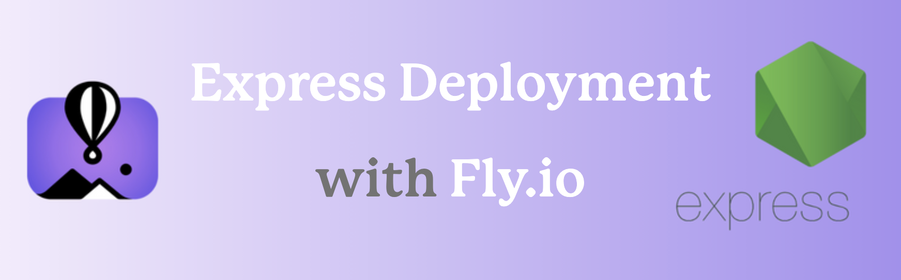

# Express Deployment with Fly.io



[This lesson](https://expressdeployment.fly.dev/) will walk you through the steps to deploy a [Node](https://nodejs.org/) [Express](https://expressjs.com/) app with [Fly.io](https://fly.io/). We will walk through all of the necessary steps from start to finish.

## Objectives

- Learn how to do a one-time install of the Fly.io CLI globally on your machine
- Set up Fly.io environment variables
- Learn how to set up a custom domain (optional)
- Create a custom build script (optional)

## Why deploy with Fly.io?

Fly.io is one of the easiest to use deployment hosts out there. In addition, it's one of the few that will allow you to deploy an Express back-end server for free (we'll still need to provide a [credit card](https://fly.io/docs/about/pricing/)).
        
The platform has been around since 2017 and is great for hosting full stack apps. It takes less than 10 minutes to get an app up and deployed, and it's extremely user friendly!

## Sign Up

***If you have never signed up with Fly.io before...***

To start, you'll need to head over to Fly.io and [sign up](https://fly.io/app/sign-up) for an account. You will be prompted to enter credit card information, but will not be charged unless your website usage surpasses [certain thresholds](https://fly.io/docs/about/pricing/#free-allowances).

## Install the Fly.io CLI Tool

In any directory in your terminal, run the following command:

```sh
curl -L https://fly.io/install.sh | sh
```

After installing the CLI, you should see an output that recommends adding two lines to your .zshrc file. They will look similar to this:

```sh
export FLYCTL_INSTALL="/Users/<your_username>/.fly"
export PATH="$FLYCTL_INSTALL/bin:$PATH"
```

Copy these lines and be sure to replace **<your_username>** with your actual Fly.io [username](https://fly.io/user/settings).

We'll need to paste these two commands at the bottom of our <b>zsh</b> settings file. Run the following command to open it up in VS Code:

```sh
open ~/.zshrc
```

Paste these lines at the bottom. Save the file. Restart your terminal.

### Authenticating the Fly.io CLI

We'll need to log into Fly.io with the CLI. To do that, run the following command:

```sh
flyctl auth login
```

## Launch Your Server

Navigate to the root directory of the project that you want to deploy. This should be where your `server.js` is located. Once there, run the following command:

```sh
flyctl launch
```

When prompted to adjust settings, type `Y` and the Fly.io [dashboard](https://fly.io/dashboard) should open up in your browser. Adjust these settings as you like, particularly your app name. The app name you choose will be in your Fly.io URL.

```sh
https://expressdeployment.fly.dev/
```

## Setting Up Environment Variables

Environment variables can be set up using the CLI by following this format:

```sh
flyctl secrets set VARIABLE=value
```

You may find that it's much easier to set these up on the Fly.io [dashboard](https://fly.io/dashboard).

## Deploy Your App

At this point, you're all ready to deploy your app. Run the following command in the root directory of your project:

```sh
flyctl deploy
```

## Recap

In this walkthrough, you successfully deployed your Node Express app to Fly.io.

Any time you make changes to your project that you want reflected on your deployed version, just commit your changes and then run `flyctl deploy` once more.

## Resources

- [Fly.io Docs](https://fly.io/docs/)
